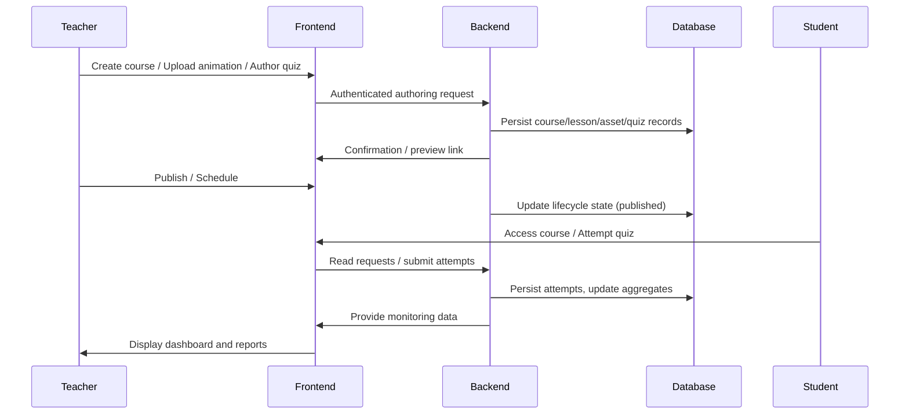
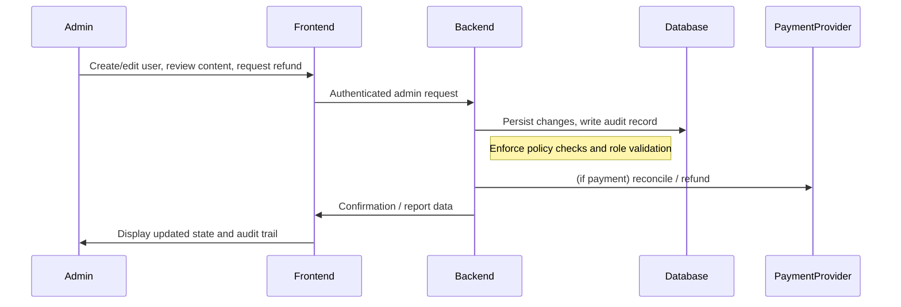

# Chapter 4: Results and Analysis

## 4.1 Common Features

This section describes the core features that are available to all authorised users of MindQuest. For each feature the purpose and benefits are explained, role-specific access is identified where applicable, and the principal data flows, validation responsibilities, and backend/database interactions are detailed.

- Authentication (Sign Up / Sign In):

	Purpose and benefits: Establishes secure, verifiable user identity and enables personalised access to content and services. Reliable authentication protects user data and enables accountability through audit logs.

	Role-specific access: All roles (students, teachers, administrators) authenticate via the same mechanism; role attributes determine permitted operations after authentication.

	Data flow and validation: Credentials or registration data are collected on the client, validated for syntactic correctness (e.g., email format, password strength) on the frontend, and transmitted to the backend over TLS. The server enforces additional validation (input sanitation, duplicate account checks) and issues a signed authentication token upon successful verification.

	Backend/database interaction: User credentials and profile metadata are persisted in the relational database. Sensitive credentials are stored only in hashed form and authentication events are logged for auditability.

- Home Dashboard:

	Purpose and benefits: Provides a consolidated view of relevant activity, personalized recommendations, and quick access to courses and notifications. The dashboard improves discoverability and helps users resume work rapidly.

	Role-specific access: Dashboard content is tailored by role—students see enrolled courses and progress summaries, teachers see authored course statistics, and administrators see system-level metrics.

	Data flow and validation: The frontend requests dashboard data through aggregated API endpoints; the backend composes responses by querying persistent stores, applying access filters based on user role, and validating that requested aggregates fall within permitted scopes.

	Backend/database interaction: Aggregations draw from relational tables (enrollments, progress, course metadata) and, where necessary, from document collections for media-rich summaries. Queries are optimized and paginated to limit payload size.

- Notifications & Messaging:

	Purpose and benefits: Delivers timely information and facilitates communication between users, thereby supporting engagement and instructor feedback loops.

	Role-specific access: Notifications may be targeted (individual student), role-limited (teacher announcements), or system-wide (admin alerts). Messaging privileges depend on role policies.

	Data flow and validation: Notification requests originate from backend processes or user actions; payloads are validated for permitted recipients and content size before enqueueing for delivery. Delivery may be immediate (real-time websocket channels) or queued for later processing.

	Backend/database interaction: Messages and notification records are stored in a document-oriented store for efficient append and retrieval; delivery metadata and audit logs are recorded in the relational database to support reporting.

- Profile Management:

	Purpose and benefits: Enables users to view and edit personal information, control privacy settings, and manage notification preferences, contributing to user autonomy and data accuracy.

	Role-specific access: All users can manage their own profile; teachers and admins have additional administrative metadata fields where appropriate.

	Data flow and validation: Profile updates are validated on the client for format and on the server for semantic constraints (unique identifiers, referential integrity checks). Server-side validation enforces authorization to prevent unauthorised modifications.

	Backend/database interaction: Profile data is persisted in relational tables with appropriate constraints; change histories and critical events are logged for traceability.

Cross-feature considerations:

- Data validation is implemented in layered form: the client performs preliminary checks to improve user experience, while the server enforces authoritative validation and sanitisation to defend against malformed or malicious input.
- Access control is enforced at the API level through token verification and role-based checks; request handlers perform additional resource-level authorization prior to data access or mutation.
- Auditability and logging are applied across common features to support debugging, compliance, and retrospective analysis; summary records are kept in relational tables while high-volume or unstructured event data may be retained in document stores with TTL policies where appropriate.

![image about "Common Features"]

## 4.2 Student Features

This section describes the principal features of MindQuest as experienced by students. Each feature is presented in three parts: (1) the student-facing interaction and user experience, (2) the system-side processing and persistent recording of relevant data, and (3) the mechanisms by which feedback and performance are conveyed back to the student. The presentation aims for clarity and concision appropriate to an academic results chapter, emphasising observable behaviour and dataflow rather than implementation minutiae.

### 4.2.1 Course Enrollment

- Student interaction: Students discover courses through the dashboard and course catalogue, review course metadata (title, description, prerequisites), and signal intent to join using an explicit enrolment action. The interface provides immediate confirmation and a view of enrolled courses and next recommended activities.
- System processing and recording: The frontend transmits an authorised enrolment request to the server, which validates eligibility, records the enrolment as a persistent association between student and course, and updates inventory or capacity counters where applicable. The persistent record captures the student identifier, course identifier, timestamp, and enrolment state (e.g., active, pending approval). These records are stored in the primary persistent store and are available for subsequent aggregation and reporting.
- Feedback and communication: Upon successful enrolment the system issues an acknowledgement to the student through the UI and creates a notification record for audit and user history. Instructors may also be notified when manual approval or review is required. Enrolment status appears on the student dashboard and in the course listing to provide persistent, discoverable confirmation.

### 4.2.2 Viewing Lessons and Animations

- Student interaction: Learning materials are organised into lessons, each of which may contain rich media assets such as animations. Students access lessons via the course interface, navigate sequentially or non-linearly, and control playback of animations and media for comprehension. The UI records coarse interaction events (e.g., lesson opened, animation played) to enable resumption and basic analytics.
- System processing and recording: Access events are logged as immutable records containing the student and resource identifiers, event type, and timestamp. Media assets are served from a content store while lesson metadata and sequencing are resolved by the backend. The system records progress markers (e.g., last-viewed position, completed flag) to support resumption and prerequisite gating.
- Feedback and communication: Immediate feedback includes visual cues (completion badges, progress bars) and contextual hints (recommended next lesson). Aggregated viewing metrics feed into progress compute routines that update the student’s progress summary; these updates are reflected on the dashboard and in periodic performance reports.

### 4.2.3 Quizzes and Progress Tracking

- Student interaction: Formative and summative quizzes are presented inline with lessons or as standalone assessments. Students submit responses through the UI and receive immediate correctness feedback for formative items; summative assessments may follow a delayed or rubric-based review workflow.
- System processing and recording: Submissions are validated and recorded as discrete assessment attempts. The system computes immediate scoring for objective items and stores per-question and per-attempt metadata (score, duration, selected options). Aggregate progress is computed from a combination of lesson completions, quiz results, and instructor-assigned assessments, producing a normalized view of course progress.
- Feedback and communication: Students receive prompt, contextual feedback for each submission (correct/incorrect, explanatory comments where available) and a running progress indicator showing course completion percentage. Significant events (e.g., completion thresholds, remediation recommendations) may generate notifications or suggested learning pathways.

### 4.2.4 Performance Reports

- Student interaction: Performance reports are accessible from the dashboard and course pages. Reports present longitudinal views of achievement (scores over time), competency breakdowns by topic, and recommended actions for improvement. The interface supports filtering by date range and assessment type.
- System processing and recording: Reporting is driven by aggregation jobs that read persistent records (enrolments, viewing logs, quiz attempts, instructor evaluations) and produce derived metrics such as moving averages, mastery estimations, and percentile ranks. These derived artifacts are stored or cached to enable responsive retrieval and to support teacher dashboards and institutional reporting.
- Feedback and communication: Reports are delivered as interactive visualisations and structured summaries. They are reinforced by targeted notifications (for example, alerts when performance drops below a threshold) and by automated recommendations that suggest remedial lessons, practice quizzes, or instructor intervention.

### 4.2.5 High-level Interaction Flow

The following diagram summarises the common interaction pattern for student activity (enrol, learn, assess, report):

### Implementation Pointers

- Controller and route handlers (high-level): [backend/src/controllers/courseController.js](backend/src/controllers/courseController.js), [backend/src/controllers/lessonController.js](backend/src/controllers/lessonController.js), [backend/src/controllers/quizController.js](backend/src/controllers/quizController.js), [backend/src/controllers/progressController.js](backend/src/controllers/progressController.js), [backend/src/controllers/reportController.js](backend/src/controllers/reportController.js), [backend/src/controllers/studentController.js](backend/src/controllers/studentController.js)
- Persistence and schema: [backend/prisma/schema.prisma](backend/prisma/schema.prisma), [backend/src/prisma/client.js](backend/src/prisma/client.js)
- Media and animations: [backend/src/controllers/animationController.js](backend/src/controllers/animationController.js)

The descriptions above intentionally remain at a system- and data-flow level to align with the thesis-style exposition used elsewhere in this document.

## 4.3 Teacher Features

This section articulates the principal capabilities exposed to teaching staff within MindQuest. Each feature is described with (1) the teacher-facing interaction model, (2) the server-side handling and persistent recording of teacher-authored artefacts, and (3) the administrative controls and monitoring facilities available to instructors and administrators. The narrative emphasises design rationale, data provenance, and how teacher actions shape the student learning environment.

### 4.3.1 Course and Lesson Creation

- User interaction: Teachers author courses through a dedicated authoring interface where they define course metadata (title, synopsis, learning objectives), arrange lesson sequences, and specify prerequisites and visibility (public, private, or cohort-limited). Lessons are authored using modular units that combine text, media, and assessment placeholders.
- Backend handling and storage: Creation requests are submitted as authenticated operations; the backend validates teacher privileges, persists course and lesson records, and establishes referential links between courses, lessons, and media assets. Persistent records capture metadata, author identifiers, timestamps, and lifecycle state (draft, published, archived). These artefacts form the canonical structure used by delivery and reporting subsystems.
- Admin/teacher controls: Teachers may edit, publish, or retire content; versioning or draft workflows support iterative refinement. Administrators may enforce organisation-wide policies (approval requirements, content moderation, capacity constraints) that affect publishing workflows.

### 4.3.2 Uploading Animations

- User interaction: Teachers upload animation files or reference external media through the course/lesson editor. The UI provides progress indicators, metadata fields (caption, license, accessibility notes), and options for in-place previewing.
- User interaction: Teachers upload animations through the authoring and studio interfaces and attach them to lessons. In addition, the course builder includes an AI-assisted HTML generation tool that produces lesson-ready interactive HTML content (previewable and downloadable) which can be inserted into a lesson as an embedded field.
- Backend handling and storage: Uploaded assets are accepted through dedicated endpoints and stored as persistent animation documents. For AI-generated HTML, the frontend requests HTML content from an automation webhook and stores it in the course draft as lesson field content (using an embeddable HTML payload) without requiring a separate media upload step.
- Admin/teacher controls: Access controls determine which assets are sharable across courses. Administrators may configure storage quotas, content retention policies, and automated checks for intellectual property compliance.

### 4.3.3 Creating Quizzes

- User interaction: Teachers author quizzes inside the course builder and may optionally use AI assistance to generate draft questions from a topic. The implemented AI flow supports the question types used by the system (e.g., MCQ, True/False, short-answer), and the UI can either insert generated questions locally into the current draft or persist them directly into the course quiz.
- Backend handling and storage: Quiz definitions and question banks are stored as structured records linked to a course. AI generation can be performed either through an external automation webhook (for rapid iteration during authoring) or via a protected backend endpoint that calls the AI service and returns normalized question objects. When persistence is requested, a protected import endpoint validates and normalizes generated questions before inserting them into the question bank and attaching them to an existing (or newly created) quiz.
- Admin/teacher controls: Teachers retain control over editing, ordering, and deleting generated questions. Server-side validation enforces minimum option counts for MCQs and requires an explicit correct answer before generated questions can be persisted.

### 4.3.4 Monitoring Student Progress

- User interaction: Teachers access dashboards and detailed student views showing enrolment lists, completion rates, per-student assessment attempts, and heatmaps of concept mastery. Interfaces support filtering, cohort comparisons, and ad hoc drill-down into attempt-level data.
- Backend handling and storage: Monitoring relies on aggregated artefacts derived from event logs (lesson visits, media interactions), assessment attempts, and instructor-evaluated items. Aggregation pipelines compute derived metrics (completion percentages, mastery estimations, time-on-task) that are cached for responsive retrieval and historical analysis.
- Admin/teacher controls: Teachers may flag students for intervention, assign remedial content, or adjust course pacing. Administrators can export reports for institutional review and configure thresholds that trigger automated notifications to students or staff.

### 4.3.5 High-level Interaction Flow (Teacher)

The sequence below summarises the typical teacher workflow for authoring, publishing, and monitoring:

### Implementation Pointers

- Representative controller files: [backend/src/controllers/courseController.js](backend/src/controllers/courseController.js), [backend/src/controllers/lessonController.js](backend/src/controllers/lessonController.js), [backend/src/controllers/animationController.js](backend/src/controllers/animationController.js), [backend/src/controllers/uploadController.js](backend/src/controllers/uploadController.js), [backend/src/controllers/quizController.js](backend/src/controllers/quizController.js), [backend/src/controllers/progressController.js](backend/src/controllers/progressController.js), [backend/src/controllers/reportController.js](backend/src/controllers/reportController.js), [backend/src/controllers/teacherController.js](backend/src/controllers/teacherController.js)
- AI services and endpoints: [backend/src/services/aiService.js](backend/src/services/aiService.js) (server-side generation), [backend/src/routes/courseRoutes.js](backend/src/routes/courseRoutes.js) (`/generate-quiz`, `/import-questions`)
- Frontend course builder (AI tools): [frontend/src/pages/TeacherCourseBuilder.jsx](frontend/src/pages/TeacherCourseBuilder.jsx), [frontend/src/services/courseService.js](frontend/src/services/courseService.js), [frontend/src/components/courseBuilder/AIGenerateModal.jsx](frontend/src/components/courseBuilder/AIGenerateModal.jsx), [frontend/src/components/courseBuilder/AIHtmlGenerateModal.jsx](frontend/src/components/courseBuilder/AIHtmlGenerateModal.jsx), [frontend/src/components/courseBuilder/HtmlPreviewModal.jsx](frontend/src/components/courseBuilder/HtmlPreviewModal.jsx)
- Persistence and schema: [backend/prisma/schema.prisma](backend/prisma/schema.prisma), [backend/src/prisma/client.js](backend/src/prisma/client.js)

The exposition deliberately remains at an architectural level to preserve focus on design intent, data provenance, and the teacher’s role within the educational workflow.

## 4.4 Admin Features

This section describes administrative capabilities provided by MindQuest. It focuses on user account governance, content approval and moderation, system usage monitoring, and oversight of payment activities. For each feature the user-facing controls, backend processing, role-based constraints, and system behaviour are explained with an emphasis on data provenance and auditability.

### 4.4.1 User Management

- User interaction: Administrators manage the user lifecycle via an administrative console. Typical actions include creating accounts, editing profile and role attributes, suspending or deleting accounts, and resetting credentials. The UI provides audit-aware forms and confirmation flows to prevent accidental privilege changes.
- Data processing and storage: Admin actions are executed as authenticated, audited transactions. Requests validate administrative privileges and persist changes to the canonical user store; audit records capture the actor, target, operation, and timestamp. Role assignments are stored as attributes on user records and drive downstream access control checks.
- Role-based access: Only accounts with administrative roles may perform these actions; role checks are enforced at the API layer and logged for traceability. Administrative changes propagate to session and token services to ensure immediate enforcement of new privileges.

### 4.4.2 Content Approval Workflow

- User interaction: Administrators and designated reviewers examine content submitted by teachers (courses, lessons, media) through a moderation interface. Items may be approved, returned for revision, or rejected with explanatory comments. The interface supports bulk operations and filtered queues (e.g., pending, flagged, scheduled).
- Data processing and storage: Moderation actions update the lifecycle state of content artefacts (pending, approved, published, rejected) and record reviewer notes. The backend enforces policy checks before publishing and may enqueue auxiliary jobs (notifications, indexing) on approval. All moderation events are retained for compliance and reporting.
- Role-based access: Approval workflows respect delegated permissions; teachers may be required to submit content for review depending on organisational policies. Administrators can configure policy parameters that govern whether content is auto-published or held for human review.

### 4.4.3 Monitoring System Usage

- User interaction: Administrative dashboards present system-wide metrics (active users, course uptake, resource utilisation), alerting thresholds, and logs for forensic inspection. Administrators can filter by time windows, cohorts, or resource types and export views for institutional reporting where supported.
- Data processing and storage: Monitoring is supplied by aggregation pipelines that consume event logs (authentication events, enrolments, content accesses, assessment attempts) and produce derived metrics that are cached for efficient retrieval. High-volume event data may be retained in a document store with configured retention policies, while summary aggregates are persisted in relational tables for reporting.
- Role-based access: Access to monitoring and logs is restricted to administrative roles and audited. Fine-grained controls may limit visibility to specific organisational units or cohorts.

### 4.4.4 System Behaviour for Admin Actions

- Transactional and audit-first: Administrative actions are treated as transactions with associated audit records. Rollback or compensating actions are handled according to the operation type (for example, revoking access tokens after account suspension).
- Immediate enforcement: Role and policy changes take effect promptly; sessions and distributed caches are invalidated or re-evaluated to ensure enforcement of new permissions.
- Notifications and escalation: Significant administrative events (mass deactivations, payment disputes, content takedowns) trigger notification workflows to affected users and optionally escalate to higher-level administrators.

### High-level Interaction Flow (Admin)

### Implementation Pointers

- Representative controller files: `backend/src/controllers/userController.js`, `backend/src/controllers/courseController.js`, `backend/src/controllers/lessonController.js`, `backend/src/controllers/reportController.js`, `backend/src/controllers/notificationController.js`, `backend/src/controllers/paymentController.js`.
- Persistence and schema: `backend/prisma/schema.prisma`, `backend/src/prisma/client.js`.
- Payment provider setup: `backend/STRIPE_SETUP.md` (configuration summary; provider-specific docs are external).

Notes: CSV/PDF export facilities are described here only if present in the codebase; no repository-level export implementation was documented during this iteration and therefore export capabilities are considered future work or out-of-scope for this chapter unless confirmed otherwise.

