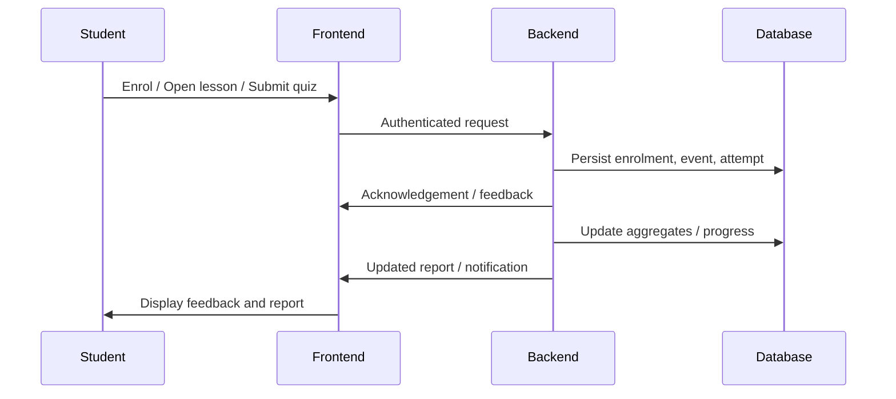
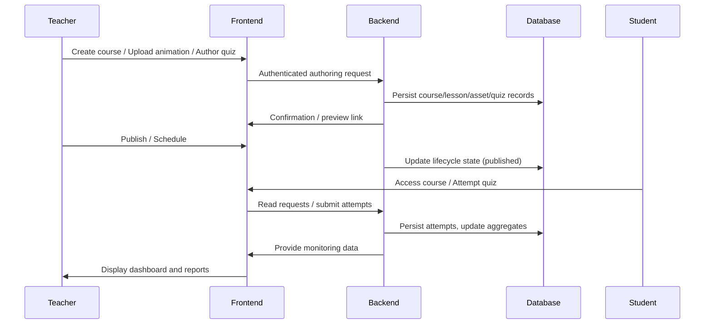
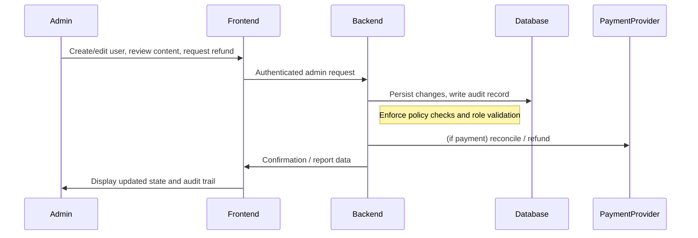

### 4.2.5 High-level Interaction Flow

The following diagram summarises the common interaction pattern for student activity (enrol, learn, assess, report):

### 4.3.5 High-level Interaction Flow (Teacher)

The sequence below summarises the typical teacher workflow for authoring, publishing, and monitoring:

### High-level Interaction Flow (Admin)

